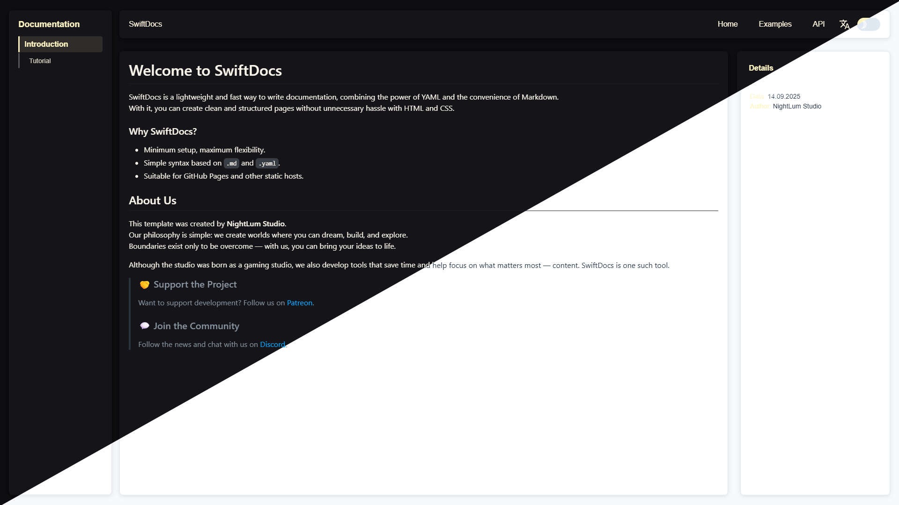

# SwiftDocs Documentation System


## About the Project

SwiftDocs is a lightweight documentation system with multilingual support and a dynamic content structure. It is designed for creating technical documentation, guides, and API references, with the ability to switch between languages and themes.

## Key Features
>  ❗NOTE
> 
>Multilingual support (configured via YAML)
>* Dynamic hierarchical menu
>* Light and dark theme switching
>* Markdown content rendering
>* Detail panel with additional information
>* Text formatting with colors and styles

## Quick Start

### For GitHub Pages

The project is fully ready to deploy on GitHub Pages:

1. **Upload the files to your GitHub repository**
2. **Enable GitHub Pages in the repository settings**:

    * Settings → Pages → Build and deployment
    * Source: "Deploy from a branch"
    * Branch: main (or your default branch), folder: `/root`
3. **Access the site at**: `https://your-username.github.io/your-repository`

### For Local Development

1. **Clone the repository**:

```bash
git clone <repository-url>
cd swiftdocs
```

2. **Run a local server** (required due to CORS policy):

```bash
# Python 3.x
python -m http.server 8000 --bind 0.0.0.0

# Or using Node.js (if installed)
npx http-server

# Or using PHP
php -S localhost:8000
```

3. **Open in your browser**:

```
http://localhost:8000
```
>⚠️ **Warning**
>   
>**Important**: Do not open `index.html` directly via the file system (`file://`). 
> Browser security policies prevent YAML and Markdown files from loading correctly. 
> Always use an HTTP server.

## Project Configuration

### Adding a New Language

1. Edit `languages.yaml`:

```yaml
- code: fr
  path: md/fr
  name: Français
```

2. Create a folder with translation files:

```
md/fr/
├── overview.md
└── tutorial_1.md
```

3. Add translations to `ui.yaml`:

```yaml
documentation:
  fr: Documentation
home:
  fr: Accueil
examples:
  fr: Exemples
```

### Configuring the Documentation Menu

Edit `docs.yaml` to modify the menu structure:

```yaml
- key: new_section
  titles:
    en: New Section
    de: Neuer Abschnitt
  file: new_section.md
  branch: overview  # Optional: for nested hierarchy
  detail: "@[#ff0000[Important info]]"
```

## Themes

The project includes two themes:

* `dark.css` — dark theme (default)
* `light.css` — light theme

Theme selection is saved in `localStorage`.

## License

This project is released under the MIT License.
